# NLP_Project
CONSIGNES : https://github.com/bouajajais/nlp-instructions/blob/main/INSTRUCTIONS_GLOBALES.md

# Lancement du projet

## Prérequis

- pip
- Python 3.11 obligatoire (car requis par la version du package litellm utilisée)

Vous pouvez l'installer via https://www.python.org/downloads/release/python-3110/

## Création d’un environnement virtuel (recommandé)
1. Dans le dossier du projet :
   > py -3.11 -m venv .venv
2. Activation de l’environnement:
   > source .venv/bin/activate (sur mac)

   > .venv\Scripts\activate          (sur windows)

Si la commande donne une erreur, executer ceci: 
  > Set-ExecutionPolicy -Scope Process -ExecutionPolicy Bypass

puis rééxecuter l'activation précédente

Une fois activé, (venv) doit apparaître dans le terminal.

3. Verifiez que votre environnement est bien sur Python 3.11 en faisant la commande suivante: 
   > python --version

## Installation des dépendances

1. Installer uv (dans le venv):
   > python -m pip install uv
2. Installer toutes les librairies du projet :
   > uv pip install -r requirements.txt

(L'installation est un peu longue car il y a beaucoup de dépendances)

## Installation de Ollama

1. Téléchargez et installez Ollama depuis https://ollama.com/download
2. Une fois installé, lancez Ollama (il s'exécutera en arrière-plan)
3. Téléchargez le modèle d'embeddings utilisé pour le RAG :
   > ollama pull nomic-embed-text

   Si la commande ollama n'est pas reconnu, ajouter le chemin absolu dans lequel se trouve ollama.exe dans les variables d'environnements, dans "Path".

**À quoi ça sert :** Ollama fournit le modèle `nomic-embed-text` qui génère les **embeddings** (représentations vectorielles) des documents PDF. Ces embeddings permettent au système RAG de chercher et récupérer les informations pertinentes des PDFs pour enrichir les réponses des agents.

## Configuration GroqCloud (API Key)
### 1) Générer une clé API GroqCloud
1. Connectez-vous à la console GroqCloud : https://console.groq.com/
2. Allez dans **API Keys**
3. Cliquez **Create API Key**
4. Donnez un nom (ex: `NLP_Project`) et validez
5. Copiez la **Secret Key** immédiatement et stockez-la de façon sécurisée (ne pas la commit dans Git)

### 2) Créer le fichier `.env`
À la racine du projet, créez un fichier `.env` avec la commande :

- _sur Mac:_ 
  > touch .env

  Puis ouvrez-le avec un éditeur :
  > nano .env

  Ajoutez la ligne suivante dans le fichier :
  GROQ_API_KEY=VOTRE_CLE_ICI
   
  Enregistrez et fermez (Ctrl+O, Entrée, Ctrl+X sur nano).

- _sur Windows:_

  À la racine du projet, créez un fichier `.env` avec la commande :
  > echo "GROQ_API_KEY=VOTRE_CLE_ICI" | Out-File -Encoding UTF8 .env

  Remplacez `VOTRE_CLE_ICI` par votre clé API réelle.

Vous pouvez également le créer à la main.

### 3) Lancer le code 

Une fois l'installation terminée, lancer l'application:
   > streamlit run app.py


-------------------------------------------------------------------------------------------------------------
## 1. Introduction
### 1.1 Contexte

Ce projet a pour objectif de créer une application de **traitement du langage naturel (NLP)** permettant de générer des **recommandations de voyage** à partir de documents textuels.
Les données utilisées sont des **documents PDF** contenant des informations sur différentes destinations.  

L’utilisateur interagit avec une interface **Streamlit** afin de définir ses préférences (destination, budget, rythme du séjour, etc.).
À partir de ces choix, une **pipeline NLP complète** est utilisée pour analyser les documents et produire un contenu adapté au profil utilisateur.

Plusieurs approches sont testées dans ce projet :
- une approche basée uniquement sur un **LLM** (*LLM only*) ;
- une approche intégrant le **Retrieval-Augmented Generation (RAG)** afin d’améliorer la qualité et la précision des recommandations.

### 1.2 Objectifs du projet
Les objectifs principaux sont les suivants :

- mettre en place le **chargement et le traitement de documents PDF** ;
- implémenter et comparer **différentes méthodes de génération de contenu** ;
- évaluer l’apport du **RAG** et des **systèmes multi-agents** par rapport à une solution simple ;
- proposer une **application fonctionnelle** permettant de comparer les résultats selon la méthode utilisée.

### 1.3 Structure du projet

Le projet est organisé de la manière suivante :

```
NLP_Project/
│
├── app.py                      # Application principale Streamlit
├── agents_sequential.py        # Implémentation des agents en mode séquentiel
├── agents_hierarchical.py      # Implémentation des agents en mode hiérarchique
├── evaluation.py               # Module d'évaluation et de calcul des métriques
├── utils.py                    # Fonctions utilitaires (prétraitement, interprétation des paramètres)
│
├── crewai_tools/              # Outils personnalisés pour CrewAI
│   ├── knowledge/             # Base de connaissances pour les agents contenant les PDFs Guide de Voyage provenant de WikiVoyage https://fr.wikivoyage.org/wiki/Accueil/
│   └── tools/                 # Outils spécifiques
│       ├── database.py        # Gestion de la base de données vectorielle
│       └── geocoder_tool.py   # Outil de géolocalisation des lieux
│
├── chroma_db_storage/         # Stockage des bases vectorielles Chroma
│   ├── Japon/                 # Base vectorielle pour le Japon
│   ├── New_York/              # Base vectorielle pour New York
│   └── Rome/                  # Base vectorielle pour Rome
│
├── image/                     # Images et diagrammes pour le README
│
├── requirements.txt           # Dépendances Python du projet
├── test.ipynb                 # Notebook de tests et expérimentations (indépendant du projet)
├── README.md                  # Documentation du projet
└── .env                       # Configuration des clés API 
```

 Description des fichiers principaux : 

- **app.py** : Point d'entrée de l'application. Contient l'interface Streamlit permettant à l'utilisateur de configurer son voyage et de comparer les différentes méthodes de génération.

- **agents_sequential.py** : Définit les agents CrewAI travaillant de manière séquentielle (expert local, concepteur d'itinéraire, auditeur budgétaire, rédacteur).

- **agents_hierarchical.py** : Version hiérarchique des agents avec un agent superviseur (utilisée à titre exploratoire).

- **evaluation.py** : Contient les fonctions d'évaluation des itinéraires (calcul des distances, LLM Judge, métriques de qualité).

- **utils.py** : Fonctions de prétraitement des documents PDF, génération des embeddings, interprétation des paramètres utilisateur.

- **crewai_tools/** : Dossier contenant les outils personnalisés utilisés par les agents CrewAI, notamment pour l'accès à la base vectorielle et la géolocalisation.

- **chroma_db_storage/** : Stockage persistant des bases vectorielles Chroma, organisées par destination. Permet d'éviter le recalcul des embeddings à chaque lancement.


## 2. Présentation des données utilisées
Les données utilisées dans ce projet sont des **documents PDF de type guide de voyage**.  
Chaque document correspond à une destination spécifique (ex. Rome, New York, Japon).

Ces documents contiennent :
- des informations générales sur la destination ;
- des descriptions de quartiers ;
- des lieux touristiques importants ;
- des conseils pratiques.

Les PDF ne sont **pas affichés directement à l’utilisateur**.  
Ils servent uniquement de **source d’information** pour enrichir les réponses générées par le modèle de langage.

### 2.1 Utilisation des données dans le projet

Les documents sont :
1. découpés en **segments de texte (chunks)** ;
2. transformés en **vecteurs (embeddings)** ;
3. stockés dans une **base de données vectorielle**.

Lors de la génération d’un itinéraire, les passages les plus proches du contexte de la demande utilisateur sont récupérés et utilisés pour améliorer la réponse finale.  
Cela permet d’obtenir des recommandations plus **précises** et **moins générales**.

### 2.2 Limites des données
Le nombre de documents disponibles par destination reste limité et les données ne sont pas mises à jour automatiquement.

Malgré ces limites, les données sont suffisantes pour :
- démontrer l’intérêt du **RAG** ;
- comparer les différents modes de génération implémentés dans le projet.

## 3. Prétraitement des données

Le prétraitement des données vise à transformer les documents bruts en une forme exploitable par les modèles de langage.  
Cette étape comprend le chargement des fichiers, l’extraction du texte, le découpage en segments et la préparation pour l’indexation.

### 3.1 Préparation au RAG
#### 3.1.1 Chargement des PDF et extraction du texte

Les documents PDF sont chargés et leur contenu textuel est extrait automatiquement.  
Chaque page est convertie en texte et associée à des métadonnées telles que le numéro de page ou la source.

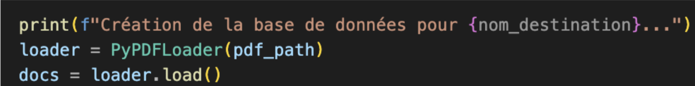


#### 3.1.2 Découpage du texte avec des chunks

Les documents étant très longs, le texte est découpé en segments de taille fixe appelés *chunks*.  
Ce découpage facilite le traitement par les modèles de langage et permet une recherche plus efficace lors de l’utilisation du RAG.

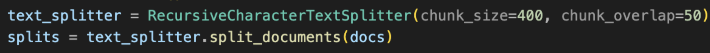


#### 3.1.3 Génération des embeddings

Chaque segment de texte est transformé en un vecteur numérique appelé *embedding*.  
Ces vecteurs permettent de mesurer la similarité entre une requête utilisateur et les passages des documents.

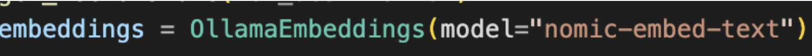


#### 3.1.4 Indexation dans une base vectorielle Chroma

Les embeddings sont stockés dans une base vectorielle qui sert de mémoire au système.  
Elle permet de retrouver rapidement les passages les plus pertinents en fonction des préférences de l’utilisateur.

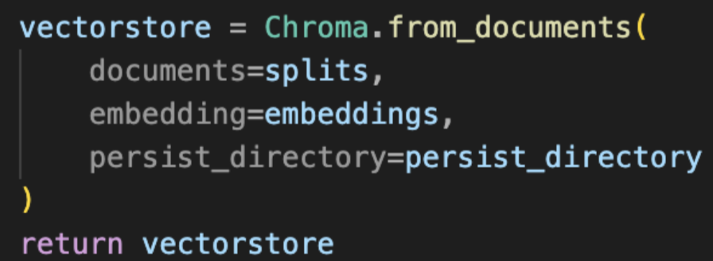


#### 3.1.5 Utilisation de la base existante

La base vectorielle est stockée afin d’éviter de recalculer les embeddings à chaque lancement de l’application.  
Le système vérifie si une base existe déjà pour une destination donnée. Cela permet de réduire le temps de chargement et d’éviter un prétraitement inutile lorsque les données ont déjà été indexées.

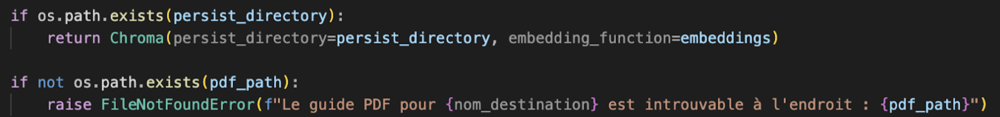


### 3.2 Interprétation des paramètres

Cette étape consiste à analyser les paramètres saisis par l’utilisateur afin de les transformer en contraintes textuelles compréhensibles par le modèle de langage.

#### 3.2.1 Interprétation des paramètres utilisateur

Les paramètres utilisateur, tels que la composition du groupe, le budget et le rythme du séjour, sont analysés pour construire un contexte clair.  
Ces informations sont intégrées dans le prompt afin d’orienter les recommandations générées.

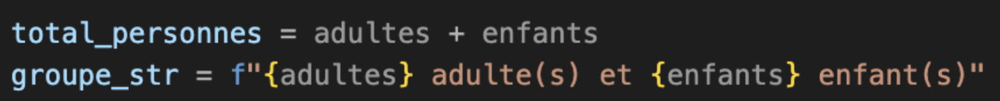


#### 3.2.2 Traduction du budget en texte

Le budget choisi par l’utilisateur est converti en une description textuelle du style de voyage attendu.  
Cela permet au modèle de mieux comprendre le niveau de prestations souhaité et d’adapter les activités proposées.

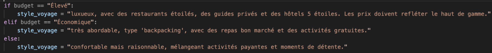


## 4. Outils utilisés

Cette section présente les principaux outils et technologies utilisés pour concevoir l’application, orchestrer les agents et générer les recommandations de voyage.

### 4.1 Le framework CrewAI

Le projet utilise le framework CrewAI, qui permet de faire travailler plusieurs agents ensemble pour produire un résultat final.  
Plutôt que d’utiliser un seul modèle pour toutes les tâches, plusieurs agents spécialisés sont utilisés afin de mieux structurer le raisonnement.

Les modèles de langage sont fournis via l’API Groq et sont basés sur Llama 3.1.  
Deux configurations principales sont utilisées : une orientée vers la planification et une autre vers la synthèse des résultats.

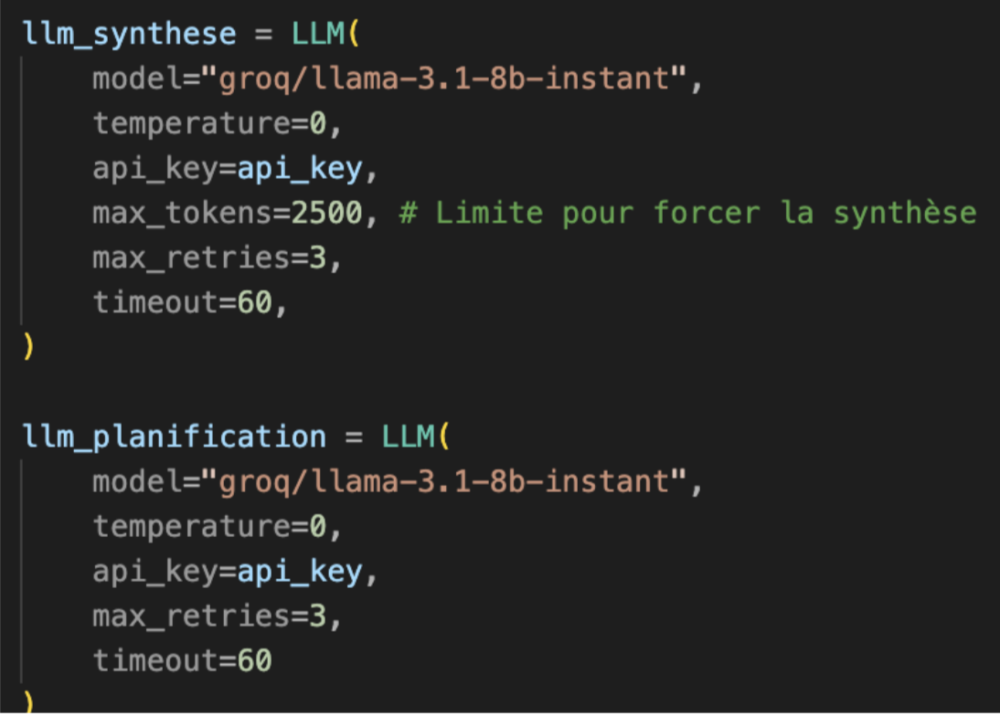

#### 4.1.1 Analyse critique et justification du choix de CrewAI

Le framework CrewAI a été choisi pour ce projet en raison de sa capacité à modéliser simplement une architecture multi-agents séquentielle. Chaque agent possède un rôle clairement défini et intervient à une étape précise du processus (sélection des lieux, organisation du planning, estimation du budget, rédaction finale). Cette organisation correspond directement à la logique métier du problème traité et facilite la compréhension du fonctionnement global du système.

De plus, CrewAI permet de contrôler précisément les sorties des agents grâce à la définition explicite des tâches et des formats attendus. Cela s’est avéré particulièrement utile dans un contexte comparatif, où l’objectif était d’évaluer différentes approches (LLM seul, multi-agents, avec ou sans RAG) de manière cohérente et reproductible.

Toutefois, CrewAI présente certaines limites. L’orchestration reste principalement séquentielle et repose fortement sur la qualité des prompts fournis. Contrairement à des frameworks plus avancés, il ne propose pas nativement de mécanismes d’auto-évaluation, de mémoire long terme ou de boucles de rétroaction complexes entre agents. Par ailleurs, crewai est trop strict sur les versions des dépendances et entraine beaucoup d'incompatibilité si l'utilisateur se trompe de version, notamment avec le package litellm. 

À titre de comparaison, le framework LangChain offre une plus grande flexibilité pour construire des chaînes complexes, intégrer des outils externes et gérer des flux dynamiques. D'autres frameworks intéressants existent comme Langgraph et AutoGen qu'on aurait pu utiliser également. Dans ce contexte, CrewAI représente un compromis pertinent entre simplicité, lisibilité et efficacité.


#### 4.1.2 Les agents

Un agent correspond à un rôle attribué à un modèle de langage.  
Chaque agent se concentre uniquement sur sa mission, ce qui permet d’obtenir des résultats plus organisés.

Chaque agent possède :
- un rôle précis (par exemple : choisir les lieux, organiser le planning),
- un objectif clair à atteindre.

Ces éléments sont complétés par plusieurs paramètres qui permettent d’orienter le comportement de l’agent.

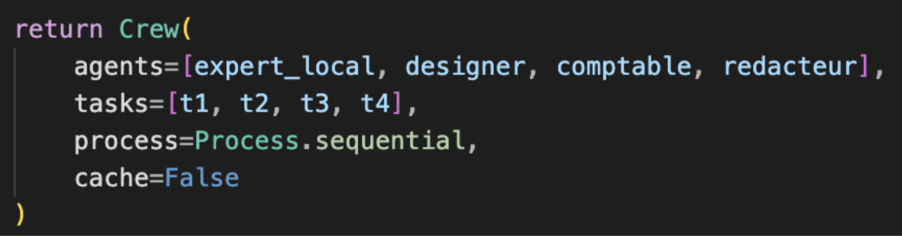

### 4.2 API Groq (LLM)

Les modèles de langage utilisés dans ce projet sont fournis via l’API Groq.  
Cette API permet d’accéder à des modèles performants basés sur Llama 3.1.

Plusieurs configurations de modèles sont utilisées selon les besoins :
- un modèle orienté planification, pour organiser les activités et le planning ;
- un modèle orienté synthèse, pour produire un rendu final clair et lisible.

Les paramètres comme la température ou le nombre maximal de tokens sont ajustés afin de contrôler la qualité et la longueur des réponses.  
L’API Groq offre également des temps de réponse rapides, ce qui est important pour une application interactive.

Groq propose un tableau de bord permettant de suivre en temps réel la consommation de tokens par modèle, ce qui facilite le suivi de l’utilisation de l’API.

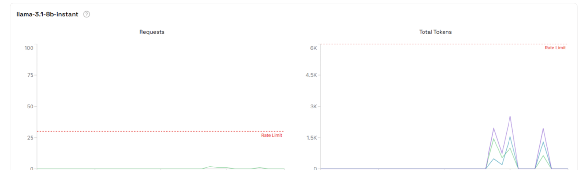


### 4.3 Cartes interactives : Folium

Afin de compléter les recommandations textuelles, la bibliothèque Folium est utilisée.  
Elle permet de générer des cartes interactives basées sur OpenStreetMap.

À partir de l’itinéraire généré, les lieux mentionnés sont géolocalisés et affichés sur une carte.  
Chaque étape du parcours est représentée par un marqueur numéroté, et les déplacements sont matérialisés par des lignes reliant les points successifs.

Cette carte interactive est intégrée directement dans l’interface Streamlit et permet à l’utilisateur de :
- visualiser la répartition géographique des activités ;
- mieux comprendre l’enchaînement des déplacements ;
- comparer visuellement l’optimisation du parcours entre les différentes méthodes.

L’ajout de cette visualisation rend les résultats plus lisibles et plus concrets.

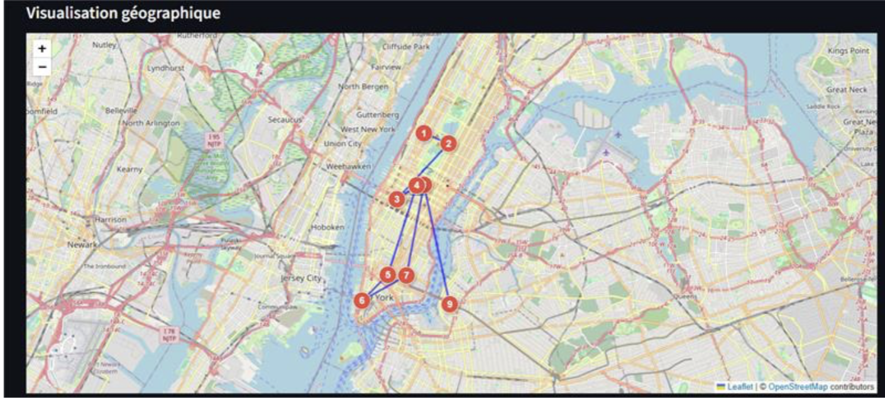


## 5. Approche simple (LLM only)

Dans cette approche, un seul modèle de langage est utilisé pour générer l’ensemble du séjour.  
Le modèle reçoit les préférences de l’utilisateur et produit directement l’itinéraire final.
Cette méthode sert de référence pour comparer les autres configurations, notamment celles utilisant le RAG et les systèmes multi-agents.

### 5.1 Principe de fonctionnement
Les paramètres saisis par l’utilisateur (destination, durée, budget, profil, rythme, centres d’intérêt et composition du groupe) sont regroupés dans un seul prompt.  
Ce prompt est envoyé au modèle de langage, qui génère un guide complet au format texte.

### 5.2 Implémentation générale
### 5.2.1 Création d’un prompt unique

Un seul prompt est construit à partir des paramètres utilisateur.  
Le modèle génère ensuite l’itinéraire sans s’appuyer sur des données externes ou des agents spécialisés.
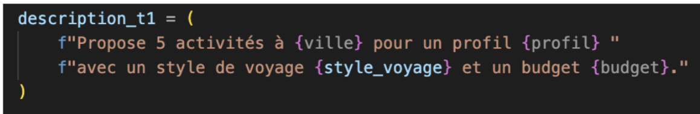
### 5.2.2 Création d’un « super prompt »

Cette approche repose sur l’exécution directe du modèle de langage, sans CrewAI.  
Un prompt détaillé est préparé afin de guider précisément le modèle dans la génération du séjour, sans produire immédiatement la sortie finale. 

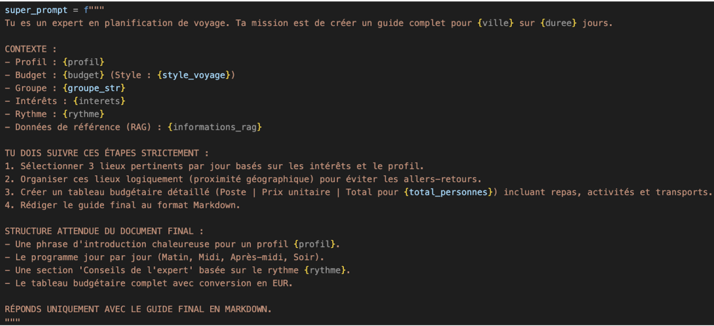

On ne définit pas plusieurs rôles. La génération est faite en une fois à partir du prompt, avec une température à 0 pour garder des réponses stables et comparables. 

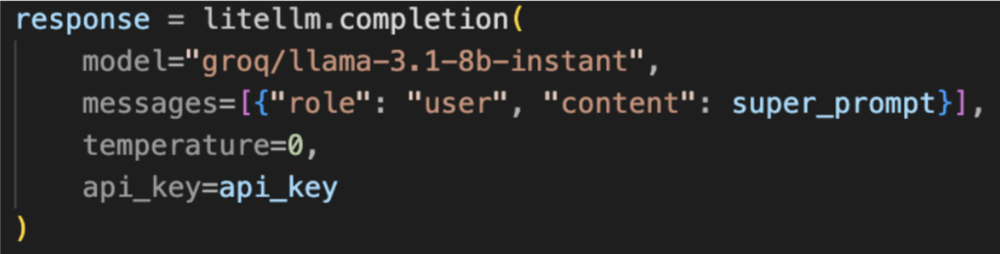


### 5.3 Résultat obtenu sur Streamlit

Cette section présente le résultat généré par l’application dans l’interface Streamlit pour l’approche simple (LLM only).

Le système produit un programme jour par jour comprenant :
- les activités proposées pour chaque journée ;
- une organisation par moments de la journée ;
- une estimation budgétaire globale ;
- des conseils pratiques pour le séjour.

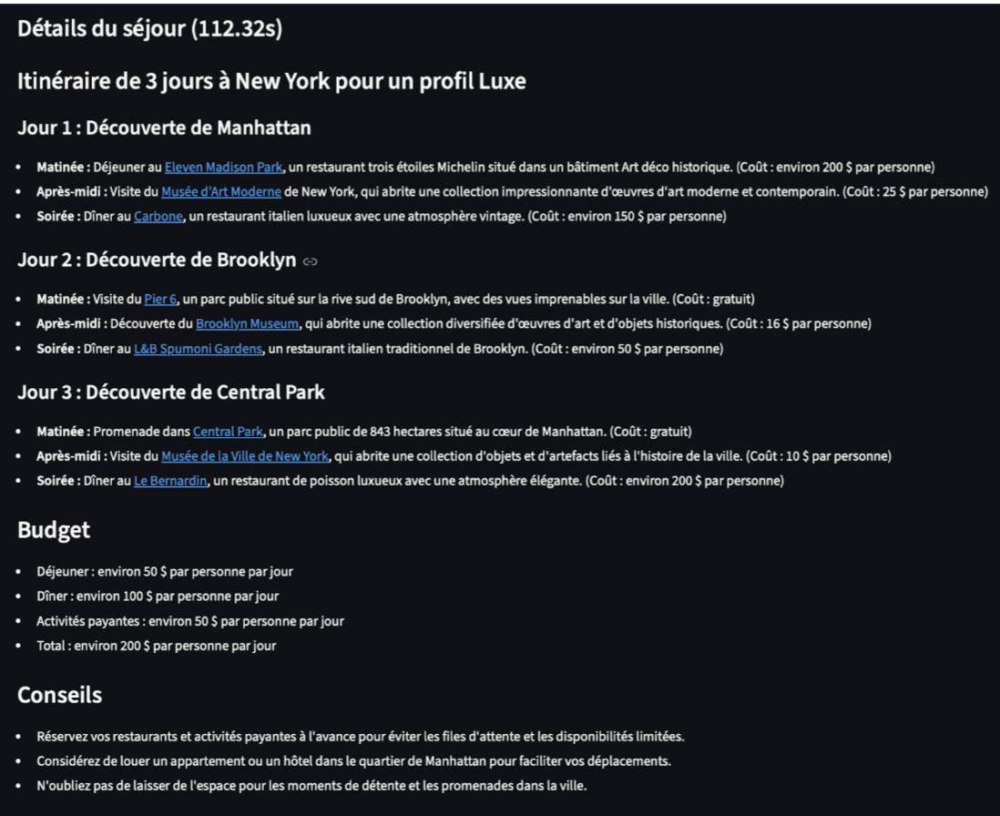

Le rendu obtenu est cohérent et lisible.  
Cependant, il peut manquer de précision ou de détails pratiques, car l’itinéraire dépend uniquement des connaissances internes du modèle, sans s’appuyer sur des documents externes.

## 6. Méthodes multi-agents

Les méthodes multi-agents utilisent plusieurs agents spécialisés au lieu d’un seul modèle.  
Chaque agent traite une partie précise du travail, comme le choix des lieux, l’organisation du planning, le budget ou la rédaction finale.


### 6.1 Les différentes approches

Dans ce projet, le processus est découpé en plusieurs étapes :
sélection des lieux → organisation du planning → calcul du budget → rédaction finale.

Les agents utilisés sont :
- un expert local, spécialiste de la destination ;
- un concepteur d’itinéraire personnalisé ;
- un auditeur budgétaire ;
- un rédacteur de guide de voyage.

Les agents travaillent principalement de manière séquentielle.  
Cela signifie qu’ils interviennent les uns après les autres, chaque agent utilisant le résultat produit par le précédent.  
Cette approche est simple, facile à comprendre et permet de comparer clairement les résultats entre les différents modes testés.

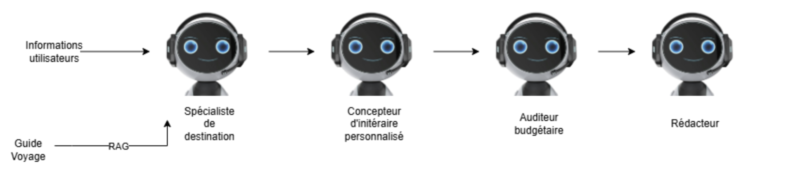

Une approche hiérarchique a également été testée.  
Dans ce cas, un agent principal supervise les autres agents et vérifie la cohérence globale du travail.  
Cette méthode est plus complexe et demande plus de temps de calcul. Elle est utilisée uniquement à titre exploratoire et n’est pas prise en compte dans les comparaisons finales.

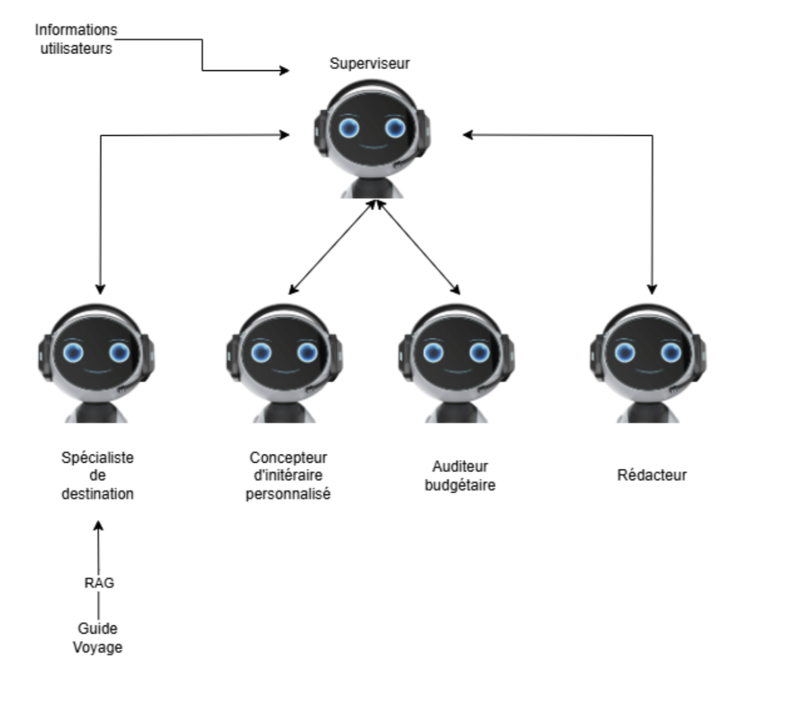


### 6.2 Exemple d’implémentation de l’agent budget

Pour éviter les répétitions, seul l’agent budgétaire est détaillé ici.  
Cet agent transforme le planning en un coût total en tenant compte des repas, des activités, des transports, du nombre de personnes et du style de voyage.

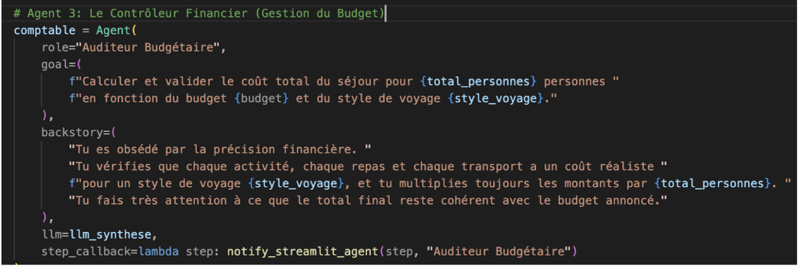
Son rôle est de vérifier que les prix sont réalistes pour le budget choisi, de multiplier les coûts par la taille du groupe et de produire un tableau de budget clair.

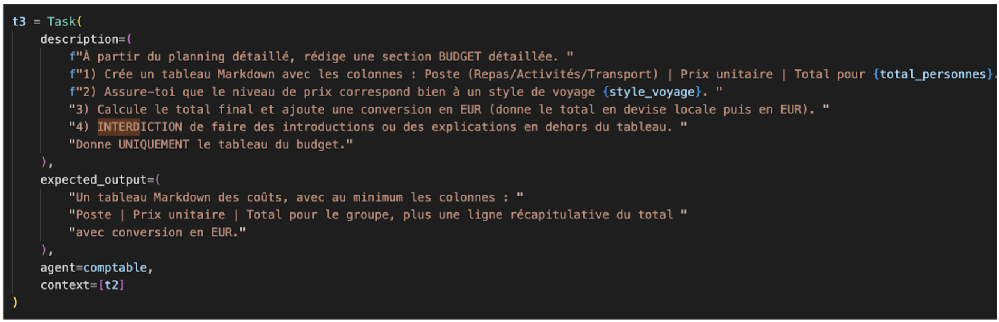

### 6.3 Multi-agents only
Dans ce mode, les agents travaillent uniquement à partir des paramètres fournis par l’utilisateur, sans utiliser de documents externes.  
L’objectif est d’obtenir un résultat plus structuré qu’avec un seul prompt, tout en restant basé sur les connaissances internes du modèle.
### 6.4 Résultat obtenu sur Streamlit
Le résultat obtenu avec l’approche multi-agents est plus organisé que dans le mode LLM seul.  
Le planning est plus clair et le budget est mieux structuré.  
Cependant, certains choix restent approximatifs, car ils reposent uniquement sur les connaissances générales du modèle.

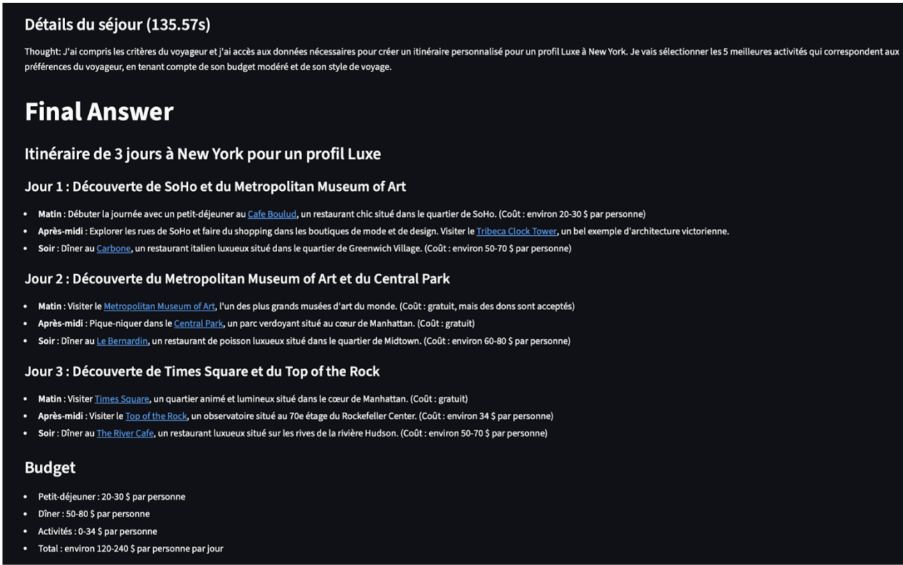

 

## 7. Intérêt de l’utilisation du RAG
Le RAG (Retrieval-Augmented Generation) ajoute une étape de recherche dans des documents PDF avant la génération de la réponse.  
Avant de produire un itinéraire, le système récupère des passages pertinents extraits des guides de voyage et les fournit au modèle de langage.
Le modèle s’appuie alors sur ces informations pour générer un itinéraire plus précis et plus réaliste.

### 7.1 Avantages

L’utilisation du RAG permet :
- de proposer des recommandations plus fiables ;
- de réduire les informations inventées par le modèle ;
- de mieux adapter le contenu à la destination choisie.

### 7.2 LLM + RAG
Cette configuration combine un modèle de langage classique avec une phase de recherche dans les documents.

#### 7.2.1 Résultat obtenu sur Streamlit
Le planning généré est plus détaillé et les estimations budgétaires sont plus réalistes, car elles s’appuient sur des informations issues des documents.On peut donc remarquer que le budget total pour 2 personnes est de  : 1944,40 €


#### 7.2.2 Évaluation : LLM only vs LLM + RAG

Pour la comparaison, seul le résultat final de chaque configuration est pris en compte.  
Cette comparaison permet de mettre en évidence l’apport du RAG sur la qualité des recommandations, la précision des conseils et le réalisme du budget.

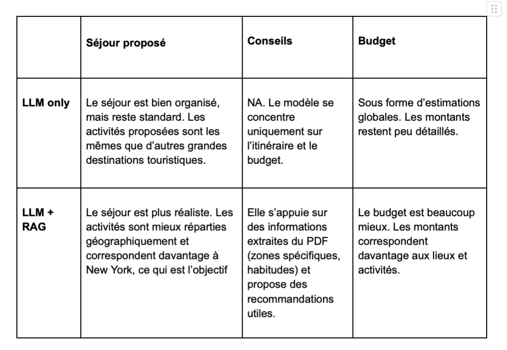

### 7.3 Multi-agents + RAG

Dans cette configuration, les agents travaillent ensemble en utilisant à la fois les paramètres fournis par l’utilisateur et des informations issues de documents externes liés à la destination.  
Ces documents permettent aux agents de s’appuyer sur des données réelles, comme les quartiers, les distances ou les pratiques locales, afin de produire un itinéraire plus précis.

#### 7.3.1 Résultat obtenu sur Streamlit

Dans l’interface Streamlit, le mode multi-agents avec RAG propose des itinéraires plus détaillés et un budget plus réaliste.  
Le résultat final est plus crédible pour l’utilisateur, car il repose à la fois sur une organisation structurée et sur des informations issues de documents réels.

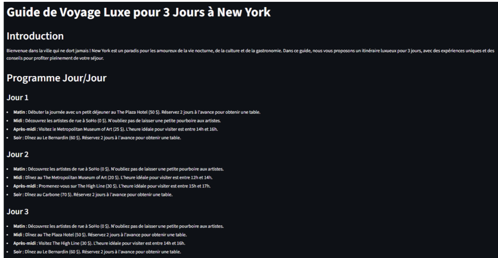
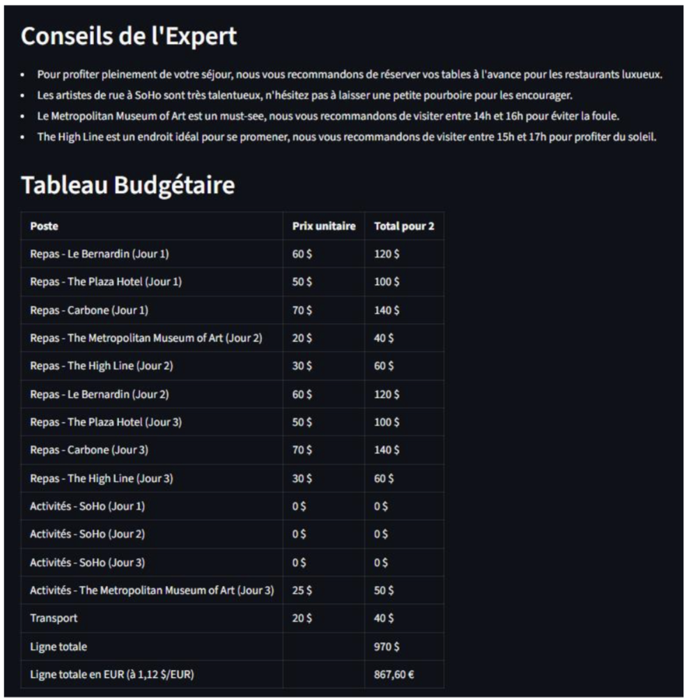

#### 7.3.2 Évaluation : Multi-agents only vs Multi-agents + RAG

Pour la comparaison, seul le résultat final de chaque configuration est pris en compte.

- **Multi-agents only** :  
  Le séjour est bien organisé, mais reste parfois trop général. Les choix sont principalement basés sur des connaissances générales.

- **Multi-agents + RAG** :  
  Le séjour est plus réaliste et mieux adapté à la destination. Les recommandations sont plus précises, les trajets sont mieux regroupés et le budget est globalement plus fiable.


## 8. Analyse des résultats et métriques

Afin de comparer les différentes approches (LLM seul, RAG, multi-agents), une page d’analyse dédiée a été intégrée à l’application.  
L’objectif n’est pas uniquement de mesurer la rapidité d’exécution, mais surtout d’évaluer la qualité et la cohérence des itinéraires générés.

### 8.1 Description des métriques utilisées
Les métriques utilisées permettent d’évaluer à la fois les performances techniques et la qualité perçue des itinéraires.  
Elles combinent des indicateurs objectifs (temps, distance) et une évaluation qualitative réalisée par un LLM Judge.

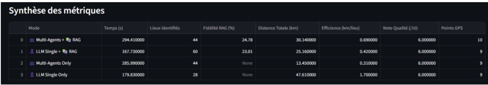

#### 8.1.1 Temps d’exécution
Cette métrique mesure le temps total nécessaire pour générer un itinéraire complet.  
Elle permet de comparer le coût temporel des approches simples, comme le LLM seul, avec des architectures plus complexes telles que le RAG ou les systèmes multi-agents.

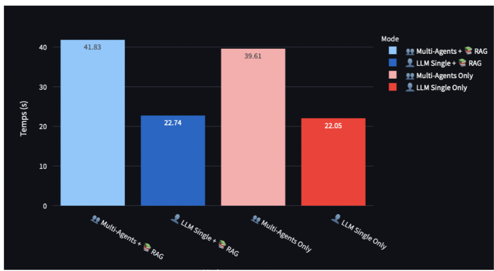

#### 8.1.2 Optimisation du trajet et efficience géographique
La distance totale est calculée à partir des coordonnées GPS des lieux proposés.  
Elle correspond à la somme des distances entre chaque étape du parcours.  
Une distance plus faible indique une meilleure organisation géographique.

Un second indicateur correspond au ratio entre la distance totale et le nombre de lieux.  
Plus cette valeur est faible, plus les lieux sont regroupés intelligemment, ce qui améliore le confort du voyage.


#### 8.1.3 Note de qualité (/10) – LLM Judge

Un modèle de langage joue le rôle de juge et évalue la qualité globale de l’itinéraire.  
Il prend en compte la personnalisation, la cohérence géographique, l’adaptation au groupe (présence d’enfants) et la richesse des informations pratiques.

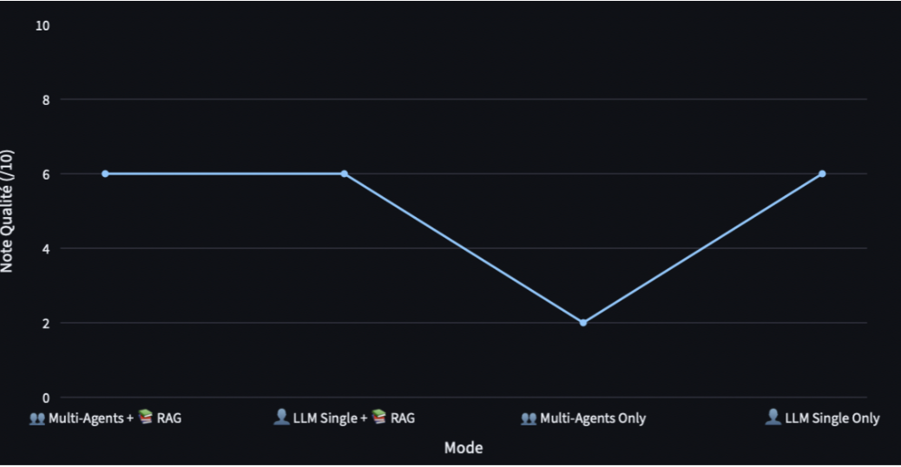

### 8.2 Focus sur le LLM Judge
Les métriques numériques seules ne suffisent pas pour déterminer si un itinéraire est réellement adapté à un utilisateur.  
Un itinéraire peut être rapide et bien optimisé tout en ne respectant pas les contraintes du voyageur.

Pour cette raison, un LLM Judge a été ajouté.  
Il s’agit d’un modèle de langage utilisé uniquement pour évaluer la qualité des itinéraires générés, de manière proche d’un jugement humain.

Le LLM Judge vérifie si l’itinéraire respecte :
- le profil du voyageur et ses centres d’intérêt ;
- la présence d’enfants et la logistique du groupe ;
- le rythme demandé ;
- la cohérence géographique du parcours ;
- la présence d’informations pratiques utiles.

Chaque critère est noté sur 10, puis une note moyenne est calculée.  
Une courte justification accompagne chaque score.

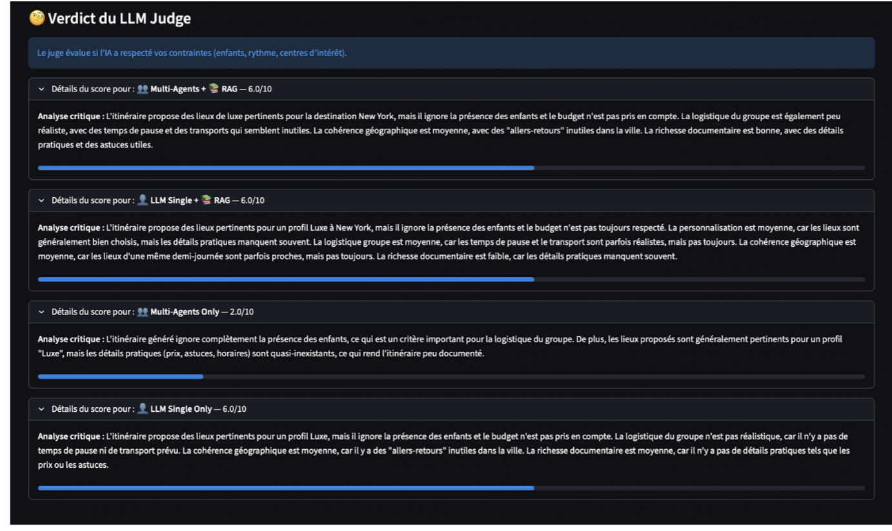

### 8.2.1 Intérêt du LLM Judge dans l’analyse

L’utilisation du LLM Judge permet de comparer les différentes méthodes de manière plus juste.  
Il montre que la rapidité d’exécution ne garantit pas la qualité finale.

Les résultats indiquent que les approches multi-agents, en particulier lorsqu’elles sont combinées au RAG, produisent des itinéraires plus cohérents, mieux organisés et plus adaptés aux contraintes utilisateur.

### 8.2.2 Principe de fonctionnement

Le LLM Judge reçoit la configuration du voyage ainsi que le texte de l’itinéraire généré.  
Il analyse le contenu et retourne une note globale accompagnée d’une justification.

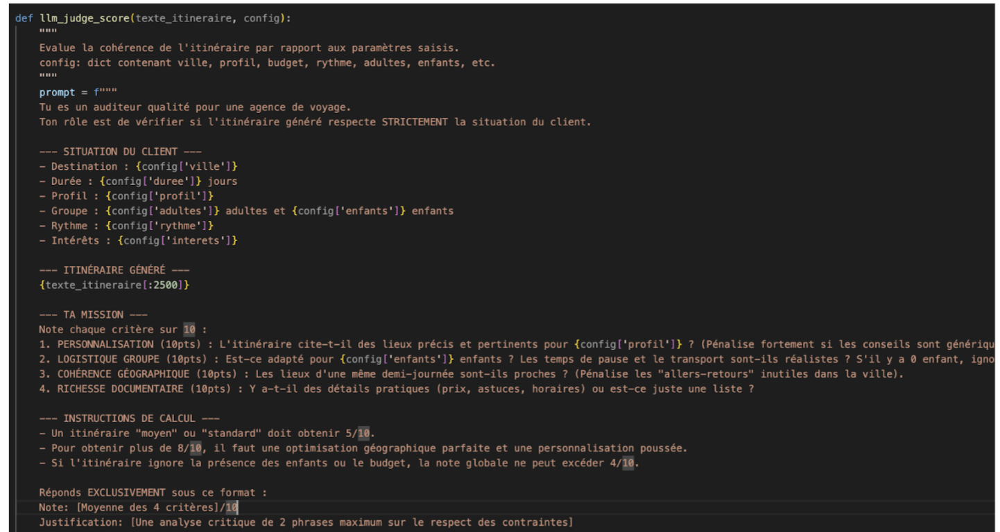

Cette approche garantit une évaluation automatique, cohérente et identique pour toutes les méthodes testées.

#### 8.2.3 Limites
Le LLM Judge reste un modèle de langage et son évaluation n’est pas parfaite.  
Cependant, dans le cadre de ce projet, il apporte une analyse plus complète et plus proche de l’expérience réelle d’un utilisateur.

 
## 9. Conclusion

Ce projet a permis de comparer différentes approches de génération de recommandations de voyage à partir de documents textuels.
Les résultats montrent que l’utilisation d’un modèle de langage seul permet de générer rapidement un itinéraire, mais reste limitée en précision et en personnalisation.
L’ajout du RAG améliore nettement la qualité des recommandations en s’appuyant sur des informations issues de documents réels.  
Les architectures multi-agents apportent une meilleure structure et une meilleure organisation des résultats.

Enfin, la combinaison **multi-agents + RAG** apparaît comme la solution la plus complète.  
Elle produit des itinéraires plus cohérents, plus réalistes et mieux adaptés aux contraintes de l’utilisateur.

Ce projet met en évidence l’intérêt de combiner différentes techniques de NLP pour améliorer la qualité des systèmes de génération de contenu, tout en soulignant les compromis entre complexité, temps d’exécution et qualité finale.


